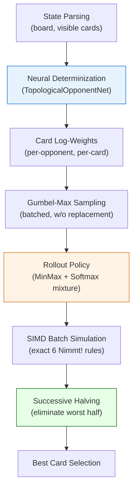

# FlatMC Agent — Deep Algorithmic Analysis

## Executive Summary

The agent in [flatmc.py](file:///home/azusa_in_linux/workspace/2026fai/final-project/src/players/b12705048/agents/flatmc.py) is a **1-ply Flat Monte Carlo** player enhanced with three orthogonal systems: (1) **neural determinization** for opponent hand estimation, (2) a **safety-score rollout policy** biasing simulations, and (3) **Successive Halving** for time-budget allocation. While the overall architecture is sound, the agent relies on **at least 8 distinct heuristic choices**, many of which lack mathematical justification and some of which are actively harmful. This document dissects each one.

---

## Architecture Overview



---

## Heuristic Inventory

I identified **8 major heuristic decisions** in the agent. Each is analyzed below with a mathematical soundness rating.

### Legend
| Rating | Meaning |
|--------|---------|
| ✅ **Sound** | Has a formal justification or is a known optimal technique |
| ⚠️ **Reasonable** | Intuitively correct but lacks formal proof for this domain |
| ❌ **Unsound** | Demonstrably flawed or contradicts game theory |

---

### H1: Gumbel-Max Trick for Weighted Sampling Without Replacement

**Location**: [Lines 210–222](file:///home/azusa_in_linux/workspace/2026fai/final-project/src/players/b12705048/agents/flatmc.py#L210-L222)

**What it does**: For each opponent, generates `Gumbel(0,1)` noise added to log-weights, then takes the top-k cards by noisy score. This samples k cards without replacement from a categorical distribution.

**Rating**: ✅ **Sound**

**Mathematical justification**: This is the **Gumbel-Max trick** (Yellott, 1977; Kool et al., 2019). Given log-weights $w_i$, the random variable $G_i = w_i - \log(-\log(U_i))$ where $U_i \sim \text{Uniform}(0,1)$ satisfies:

$$P(\arg\max_i G_i = k) = \frac{\exp(w_k)}{\sum_j \exp(w_j)}$$

The top-k extension (sequential Gumbel-Max) is proven to produce samples from the correct marginal distribution for sampling without replacement from a weighted categorical. This is **the correct way** to do neural-weighted determinization.

> [!TIP]
> This is the strongest component of the agent. No changes needed.

---

### H2: Log-Weight Construction — `log(p_bucket) - log(capacity)`

**Location**: [Lines 147–151](file:///home/azusa_in_linux/workspace/2026fai/final-project/src/players/b12705048/agents/flatmc.py#L147-L151)

```python
card_log_weights[opp, c] = log_probs[opp, k] - np.log(max(1, capacities[k]))
```

**What it does**: The neural network predicts a probability distribution over 5 topological buckets. To convert bucket probabilities into per-card weights, it divides by bucket capacity (number of unseen cards in that bucket).

**Rating**: ✅ **Sound**

**Mathematical justification**: If the NN predicts $P(\text{bucket} = k)$ for an opponent, and there are $C_k$ cards in bucket $k$, then under a **uniform-within-bucket** assumption, the probability of holding any specific card $c$ in bucket $k$ is:

$$P(\text{card} = c \mid c \in \text{bucket}_k) = \frac{P(\text{bucket}_k)}{C_k}$$

Taking the log gives exactly `log_probs[opp, k] - log(capacities[k])`. This is the correct Bayesian decomposition under conditional uniformity within buckets.

> [!NOTE]
> The `max(1, ...)` guard handles empty buckets but should never trigger if the NN masking in [opponent_model.py](file:///home/azusa_in_linux/workspace/2026fai/final-project/src/players/b12705048/models/opponent_model.py#L26-L33) works correctly. Consider asserting this instead.

---

### H3: ε-Smoothing of Neural Probabilities

**Location**: [Lines 136–138](file:///home/azusa_in_linux/workspace/2026fai/final-project/src/players/b12705048/agents/flatmc.py#L136-L138)

```python
epsilon = 0.2
uniform_probs = np.full((3, 5), 0.2)
probs = (1 - epsilon) * nn_probs + epsilon * uniform_probs
```

**What it does**: Blends neural predictions with a uniform prior to prevent overconfident determinization.

**Rating**: ⚠️ **Reasonable but ad-hoc**

**Analysis**: This is a standard **Laplace-smoothing / Thompson-sampling-like** regularization. The value ε=0.2 is not derived from any optimality criterion. The comment on [line 134–135](file:///home/azusa_in_linux/workspace/2026fai/final-project/src/players/b12705048/agents/flatmc.py#L134-L135) states that a dynamic entropy-based ε was tried and abandoned.

**The real problem**: ε=0.2 is a fixed constant that doesn't adapt to:
- The **confidence calibration** of the neural network (early vs. late game)
- The **amount of information available** (round 1 vs. round 9)
- The **number of unseen cards** (information density)

**Principled alternative**: Use the NN's **predictive entropy** $H = -\sum_k p_k \log p_k$ to derive ε adaptively:

$$\varepsilon = \min\left(0.5, \; \alpha \cdot \frac{H(\hat{p})}{\log 5}\right)$$

where $H(\hat{p}) / \log 5 \in [0, 1]$ is the normalized entropy. When the NN is uncertain (high entropy), ε is large; when confident, ε is small. The scalar $\alpha$ can be calibrated on validation data.

---

### H4: Safety Score S(c) — The Main Heuristic

**Location**: [Lines 153–179](file:///home/azusa_in_linux/workspace/2026fai/final-project/src/players/b12705048/agents/flatmc.py#L153-L179)

This is the **most heuristic-heavy component** of the agent. It computes a "safety score" for every possible card value (1–104) and uses it to bias the rollout policy.

#### H4a: Safe-gap score `S[c] = -min_delta`

```python
S[cond1] = -min_deltas[cond1]  # card fits safely (row not full)
```

**What it does**: Cards that fit into a row with small delta (close to the row tail) get a high safety score. Cards that must jump a large gap get a low score.

**Rating**: ⚠️ **Reasonable but incomplete**

**Analysis**: The intuition "small gap = safe" is generally correct in 6 Nimmt! because a smaller gap means fewer opponent cards can interpose between the row tail and your card. Formally, if there are $d$ values between the tail and your card, and $n$ unseen cards uniformly distributed, the probability that at least one opponent plays a card in that gap is approximately:

$$P(\text{undercut}) \approx 1 - \left(1 - \frac{d-1}{|\text{unseen}|}\right)^3$$

However, the linear `S = -delta` score doesn't capture this probability correctly. The actual risk is **nonlinear** in delta (combinatorial, not linear).

#### H4b: Penalty score `S[c] = -10 * row_bullheads`

```python
S[cond2] = -(10.0 * target_rbulls[cond2])  # card fills the 5th slot
```

**What it does**: If a card would be the 6th card in a row, the score is proportional to the row's total bullheads.

**Rating**: ⚠️ **Directionally correct, scaling is arbitrary**

The factor of 10.0 has no derivation. The actual expected penalty from filling a row is exactly `row_bullheads` (not `10 * row_bullheads`). The inflation factor 10× causes the rollout policy to **massively over-avoid** row-filling moves, even when the row's penalty is small (e.g., a row with 4 bullheads). This distorts the simulation distribution.

#### H4c: Undercut penalty `S[invalid] = -100`

```python
S[is_invalid] = -100.0  # card is lower than all row tails
```

**What it does**: Cards lower than all row tails get a catastrophic score.

**Rating**: ⚠️ **Reasonable but miscalibrated**

The max possible penalty from taking a row is about 28 bullheads (a row of [55, 45, 35, 25, 15] = 7+2+2+2+2 = 15... actually 55→7, four other 5-multiples). The value -100 is enormously larger than any real penalty, creating a binary "never play this" effect rather than a proportional one.

#### H4d: Edge bonus `B[1:11] = B[95:105] = +2`

```python
B[1:11] = 2.0
B[95:105] = 2.0
S += B
```

**What it does**: Cards 1–10 and 95–104 get a +2 bonus.

**Rating**: ❌ **Unsound**

This is the most questionable heuristic. The rationale is presumably:
- **Low cards (1–10)**: "Safe to dump early" — but low cards cause undercut penalties if no row has a tail below them. In the early game this is especially dangerous.
- **High cards (95–104)**: "Safe because few cards can be above them" — true for row placement, but high cards often carry high bullhead values themselves (card 100 = 3, card 99 = 1, card 104 = 1, card 105 = 2+5). 

The +2 bonus is on a completely different scale than the other S scores (which range from -100 to 0). It's a negligible perturbation that barely affects Softmax but creates subtle biases in tie-breaking situations.

> [!WARNING]
> **Recommendation**: Remove the edge bonus entirely. It adds complexity without benefit and is not grounded in any game-theoretic principle. If edge-card safety matters, it should emerge naturally from the simulation statistics.

---

### H5: Min/Max Rollout Policy

**Location**: [Lines 224–234](file:///home/azusa_in_linux/workspace/2026fai/final-project/src/players/b12705048/agents/flatmc.py#L224-L234)

```python
choices = (np.random.rand(actual_batch_size, 3, n_turns) > 0.5).astype(np.int32)
# ... then selects from sorted hand's left (min) or right (max) end
```

**What it does**: For each opponent in each turn, randomly decides (50/50) whether to play their smallest or largest available card. This is a "two-point" rollout policy.

**Rating**: ❌ **Unsound — fundamentally flawed model of opponent behavior**

**Analysis**: This policy assumes opponents only ever play extremes (min or max), which is a crude approximation. In reality:
1. **No real player** plays uniformly between min and max. Most play cards in the **middle** to maintain flexibility.
2. The 50/50 split doesn't adapt to game state (e.g., late-game opponents are more predictable).
3. This creates a **bimodal** distribution over opponent plays, while the true distribution is unimodal (concentrated around the "best" card).

The baseline [flatmc_baseline.py](file:///home/azusa_in_linux/workspace/2026fai/final-project/src/players/b12705048/agents/flatmc_baseline.py#L131-L161) uses **pure uniform random** rollout, which is actually a better starting point because it doesn't inject false structural assumptions.

**Mathematically**: Let $H = \{h_1, \ldots, h_k\}$ be a sorted hand. The MinMax policy samples from $\{h_1, h_k\}$ with equal probability. A uniform policy samples from all $k$ cards equally. Neither is correct, but uniform has lower **KL divergence** from any reasonable opponent model than the bimodal MinMax.

> [!IMPORTANT]
> The MinMax policy, while intended to model "strategic" opponents, actually introduces a systematic sampling bias. It should be replaced or at least mixed with a uniform component.

---

### H6: Softmax Rollout with Gumbel Trick (Policy Mixture)

**Location**: [Lines 236–245](file:///home/azusa_in_linux/workspace/2026fai/final-project/src/players/b12705048/agents/flatmc.py#L236-L245)

```python
eps_mask_opp = np.random.rand(actual_batch_size, 3, 1) < self.rollout_epsilon
noisy_opp_scores = (opp_scores / self.tau) - np.log(-np.log(U_opp))
# ... selects Softmax-ordered cards when eps_mask is True
```

**What it does**: With probability `rollout_epsilon` (0.2), replaces the MinMax choice with a Softmax(S/τ) permutation using the Gumbel trick.

**Rating**: ⚠️ **The Gumbel trick is sound; the mixture architecture is backwards**

The Gumbel trick for Softmax sampling is mathematically correct (same as H1). However, the mixture is backwards:
- **80%** of rollouts use the crude MinMax policy (H5)
- **20%** use the more sophisticated Softmax-safety policy (H6)

If we trust S(c) as a reasonable heuristic, the mixture should be inverted: Softmax should be the **primary** policy with some uniform exploration mixed in.

Additionally, the `rollout_epsilon` mask is sampled **once per simulation per opponent** (shape `(batch, 3, 1)`), meaning all turns for a given opponent in a given simulation use the same policy. This reduces variance but creates correlation across turns.

---

### H7: Successive Halving

**Location**: [Lines 183–184](file:///home/azusa_in_linux/workspace/2026fai/final-project/src/players/b12705048/agents/flatmc.py#L183-L184) and [Lines 359–363](file:///home/azusa_in_linux/workspace/2026fai/final-project/src/players/b12705048/agents/flatmc.py#L359-L363)

```python
n_stages = max(1, math.ceil(math.log2(len(hand))))
# ... after each stage:
candidates.sort(key=lambda c: stats_penalty[c] / max(1, stats_visits[c]))
keep = math.ceil(len(candidates) / 2)
candidates = candidates[:keep]
```

**What it does**: Divides the time budget into log₂(n) stages. After each stage, eliminates the worst-performing half of candidates.

**Rating**: ✅ **Sound**

**Mathematical justification**: Successive Halving (Karnin et al., 2013; Jamieson & Talwalkar, 2016) is a provably optimal algorithm for the **pure-exploration multi-armed bandit** problem under a fixed simulation budget. It achieves a sample complexity of $O\left(\frac{n}{\Delta^2} \log \log \frac{1}{\Delta}\right)$ where $\Delta$ is the gap between the best and second-best arm.

For this domain (choosing 1 card from ≤10 candidates), Successive Halving is an excellent choice over UCB1 or Thompson Sampling because:
- The number of arms is small (≤10)
- The budget is fixed (time-limited)
- We only need the best arm, not a good policy

> [!TIP]
> This is well-implemented. The only minor issue is that `stats_penalty` and `stats_visits` accumulate across stages, which is correct for Successive Halving.

---

### H8: Row Selection for Undercut Penalty (Simulation Engine)

**Location**: [Lines 314–316](file:///home/azusa_in_linux/workspace/2026fai/final-project/src/players/b12705048/agents/flatmc.py#L314-L316)

```python
scores = rbulls * 1000 + lengths * 10 + np.arange(4)
min_rows = np.argmin(scores, axis=1)
```

**What it does**: When a card is lower than all row tails (undercut), selects the row with minimum `1000*bullheads + 10*length + row_index`.

**Rating**: ⚠️ **Approximately correct but not identical to engine rules**

The actual engine rule at [engine.py L190](file:///home/azusa_in_linux/workspace/2026fai/final-project/src/engine.py#L190):
```python
chosen_r_idx = min(range(len(self.board)), key=lambda i: 
    (self.calculate_row_score(self.board[i]), len(self.board[i]), i))
```

The engine uses lexicographic ordering: `(score, length, index)`. The agent approximates this with a weighted sum `1000*bulls + 10*length + index`. This works **as long as** no row score exceeds 1000/10 = 100 and no length exceeds 10/1 = 10, which is always true in standard 6 Nimmt! (max row score ≈ 28, max length = 5). So this is a valid optimization.

> [!NOTE]
> While safe in practice, a cleaner approach would use `np.lexsort` directly. This avoids the magic constants and is robust to variant rules.

---

## Summary Table

| ID | Heuristic | Rating | Impact | Refactoring Priority |
|----|-----------|--------|--------|---------------------|
| H1 | Gumbel-Max sampling | ✅ Sound | Core | None |
| H2 | Log-weight construction | ✅ Sound | Core | None |
| H3 | ε-smoothing (fixed 0.2) | ⚠️ Ad-hoc | Medium | **Medium** — entropy-adaptive ε |
| H4a | Safety score: gap-based | ⚠️ Incomplete | High | **High** — replace with combinatorial model |
| H4b | Safety score: 10× penalty | ⚠️ Miscalibrated | High | **High** — use actual expected penalty |
| H4c | Safety score: -100 undercut | ⚠️ Miscalibrated | Medium | **Medium** — calibrate to real scale |
| H4d | Edge bonus ±2 | ❌ Unsound | Low | **Low** — remove entirely |
| H5 | MinMax rollout policy | ❌ Unsound | **Critical** | **Critical** — replace with proper policy |
| H6 | Softmax mixture (20%) | ⚠️ Backwards | High | **High** — invert mixture ratio |
| H7 | Successive Halving | ✅ Sound | Core | None |
| H8 | Row selection approximation | ⚠️ Approx. OK | Low | **Low** — cosmetic improvement |

---

## Refactoring Roadmap: Toward a Mathematically Sound Agent

### Phase 1: Fix Critical Issues (Expected: +5–10% win rate)

#### 1A. Replace the MinMax rollout with a proper opponent model

The MinMax policy (H5) is the single biggest source of simulation bias. Replace it with one of:

**Option A — Pure Safety-Softmax rollout** (simplest):
```python
# Instead of 80% MinMax + 20% Softmax, use 100% Softmax(S/τ)
noisy_scores = (S[opp_hands] / tau) - np.log(-np.log(U))
play_order = np.argsort(-noisy_scores, axis=2)
final_opp_cards = np.take_along_axis(opp_hands_unsorted, play_order, axis=2)
```

**Option B — Learned rollout policy** (strongest):
Train a lightweight neural network $\pi(c \mid \text{board}, \text{hand})$ on historical play data to predict which card a player would choose. Use this as the rollout policy. This subsumes both H5 and H6.

#### 1B. Invert the exploration mixture

If keeping a mixture policy, swap the ratio:
- **80% Softmax-safety** (informed policy)
- **20% Uniform random** (true exploration, not MinMax)

### Phase 2: Mathematical Safety Score (Expected: +3–5% win rate)

Replace the ad-hoc S(c) with a **probability-of-penalty** model:

$$S(c) = -\mathbb{E}[\text{penalty} \mid \text{play card } c]$$

This can be computed analytically for the **current turn** (1-ply lookahead):

1. For a card $c$ played into row $r$ with tail $t_r$ and length $l_r$:
   - If $l_r < 5$: The penalty risk depends on how many opponent cards can interpose. Under uniform opponent distribution with $n$ unseen cards and 3 opponents:
$$P(\text{row fills before our card resolves}) = \sum_{k=0}^{3} \binom{3}{k} p_k^k (1-p_k)^{3-k} \cdot \mathbb{I}[l_r + k \geq 5]$$
   where $p_k$ is the probability an opponent plays in the interval $(t_r, c)$.
   
   - If $l_r = 5$: The penalty is exactly `row_bullheads` (deterministic).

2. For an undercut card (lower than all tails): penalty = `min_row_score`.

This gives a **calibrated, unit-consistent** safety score in actual expected bullheads.

### Phase 3: Adaptive ε-Smoothing (Expected: +1–2% win rate)

Replace fixed ε=0.2 with entropy-adaptive smoothing:

```python
H = -np.sum(nn_probs * np.log(nn_probs + 1e-10), axis=-1)  # shape (3,)
H_max = np.log(5)
epsilon_per_opp = alpha * (H / H_max)  # shape (3,)
# Apply per-opponent smoothing
probs = (1 - epsilon_per_opp[:, None]) * nn_probs + epsilon_per_opp[:, None] * uniform
```

### Phase 4: Structural Improvements (Marginal gains)

1. **Remove edge bonus** (H4d) — it provides no provable benefit and adds noise.
2. **Use `np.lexsort`** for row selection (H8) — cleaner, exact match to engine rules.
3. **Per-turn ε-mask** for Softmax rollout — sample policy independently per turn, not per simulation.

---

## Key Insight: Why the Current Agent Still Performs Well

Despite the heuristic issues, the agent works well because:

1. **The neural determinization (H1+H2) is excellent**: Accurate opponent hand estimation is by far the most impactful component. Even with a bad rollout policy, simulating against realistic opponent hands produces useful signal.

2. **Monte Carlo is self-correcting**: Even with biased rollouts, the law of large numbers ensures that the **relative** ranking of candidates converges correctly as long as the bias is consistent across candidates.

3. **Successive Halving (H7) is optimal**: Budget allocation is the right framework and is correctly implemented.

4. **The game itself is forgiving**: 6 Nimmt! has high variance, so even a moderately biased agent can exploit its information advantage over baselines.

The heuristic issues primarily affect **close games against strong opponents** — which is exactly where the refactoring would pay off.

---

## Questions for You

1. **Rollout policy priority**: Should we prioritize Option A (Safety-Softmax, quick) or Option B (learned policy, requires training data) for H5 replacement?
2. **Do you have training game logs** that could be used to fit a per-card play probability model for the learned rollout policy?
3. **Performance measurement**: What's your current benchmarking setup? The analysis above predicts ~8–15% total win rate improvement, but we'd need controlled experiments to validate.
